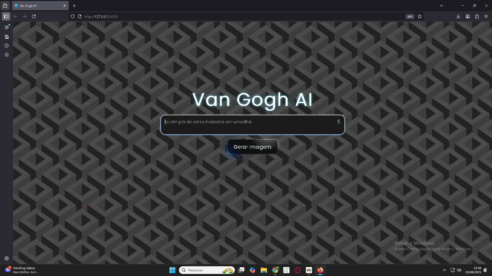

# 🎨 Van Gogh AI - Gerador de Imagens com IA

<div align="center">
  
  
  *Interface da aplicação Van Gogh AI*
  
  ---
  
  
  
  
</div>

Bem-vindo ao Van Gogh AI, uma aplicação web que utiliza inteligência artificial para gerar imagens incríveis a partir de descrições textuais. Crie obras de arte únicas com o poder do Stable Diffusion!

## ✨ Recursos

- **Geração de Imagens por Texto**: Transforme suas ideias em imagens com descrições textuais
- **Edição de Imagens**: Modifique imagens existentes com base em prompts textuais
- **Controle Avançado**: Utilize o ControlNet para maior controle sobre a geração de imagens
- **Interface Intuitiva**: Design limpo e fácil de usar
- **Suporte a GPU**: Aceleração CUDA para geração mais rápida de imagens

## 🚀 Como Usar

### Pré-requisitos

- Python 3.8 ou superior
- Git
- CUDA (opcional, mas recomendado para melhor desempenho)

### Instalação

1. Clone o repositório:
   ```bash
   git clone https://github.com/seu-usuario/van-gogh-ai.git
   cd van-gogh-ai
   ```

2. Crie e ative um ambiente virtual (recomendado):
   ```bash
   python -m venv venv
   .\venv\Scripts\activate  # No Windows
   # ou
   source venv/bin/activate  # No Linux/Mac
   ```

3. Instale as dependências:
   ```bash
   pip install -r requirements.txt
   ```
   
   > 💡 Se estiver usando GPU, instale o PyTorch com suporte a CUDA:
   > ```bash
   > pip3 install torch torchvision torchaudio --index-url https://download.pytorch.org/whl/cu118
   > ```

### Executando a Aplicação

1. Inicie o servidor Flask:
   ```bash
   python app.py
   ```

2. Acesse a aplicação no navegador:
   ```
   http://127.0.0.1:5000
   ```

## 🖼️ Modos de Geração

### 1. Texto para Imagem
Gere imagens a partir de descrições textuais. Quanto mais detalhado for o prompt, melhores serão os resultados!

### 2. Imagem para Imagem
Modifique imagens existentes com base em um prompt textual, mantendo a estrutura original.

### 3. ControlNet (Canny Edge)
Controle a geração de imagens usando bordas detectadas, permitindo maior precisão na composição.

## 📝 Dicas para Melhores Resultados

- Seja específico em suas descrições
- Inclua detalhes como estilo artístico, cores e composição
- Experimente diferentes prompts para obter variações interessantes
- Para melhores resultados, mantenha os prompts em inglês

## 🛠️ Estrutura do Projeto

```
van-gogh-ai/
├── static/           # Arquivos estáticos (CSS, JS, imagens)
├── templates/        # Templates HTML
├── uploads/          # Imagens enviadas pelo usuário
├── app.py            # Aplicação principal Flask
├── gerador.py        # Lógica de geração de imagens
├── routes.py         # Rotas da aplicação
├── requirements.txt  # Dependências do projeto
└── README.md         # Documentação do projeto
```

## 🤝 Contribuição

Contribuições são bem-vindas! Siga estes passos:

1. Faça um Fork do projeto
2. Crie uma Branch para sua Feature (`git checkout -b feature/AmazingFeature`)
3. Adicione suas mudanças (`git add .`)
4. Comite suas mudanças (`git commit -m 'Add some AmazingFeature'`)
5. Faça o Push da Branch (`git push origin feature/AmazingFeature`)
6. Abra um Pull Request

## 📄 Licença

Distribuído sob a licença MIT. Veja `LICENSE` para mais informações.

## ✉️ Suporte

Para suporte ou dúvidas, por favor abra uma issue no repositório do projeto.

## 🙏 Agradecimentos

- [Stable Diffusion](https://stability.ai/stable-diffusion) - Por fornecer o modelo de geração de imagens
- [Hugging Face](https://huggingface.co/) - Por disponibilizar os modelos e tokenizers
- [Flask](https://flask.palletsprojects.com/) - Framework web leve para Python
- [PyTorch](https://pytorch.org/) - Framework de aprendizado de máquina

---